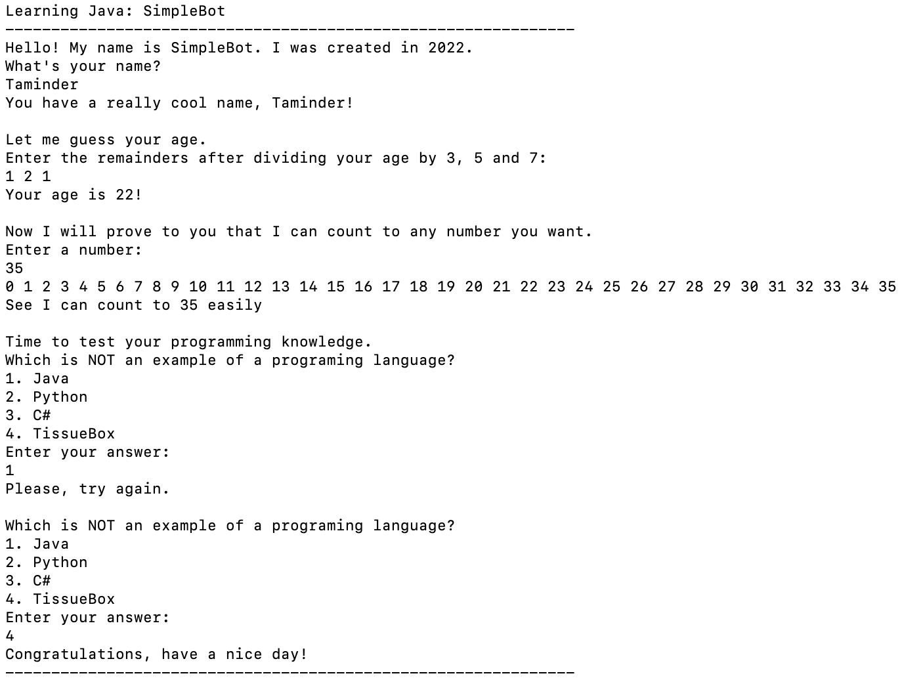

# Simple Bot
[](https://github.com/taminderpabla)


[](https://github.com/taminderpabla/simple-bot)


Quick little project to apply basic Java skills such as:
- basic syntax  
- invoking methods
- loops

## Requirements

Requires no specification.
## Running From Command Line
### SimpleBot Execution
Basic operations of the Bot includes:
- asking user their name and complimenting it
- guessing user age based on remainders (modulus operator)
- counting up to specified number using loop
- conducting short quiz (repeats until user enters correct response)



_**Figure 1:** SimpleBot running from Terminal on MacBookAir-M1_
### Execution Procedure:
1. Clone the repository (shown using SSH):
```
    $ git clone git@github.com:taminderpabla/simple-bot.git
```
2. Compile the Java file "SimpleBot.java" (found under 'src' folder):
```
    % javac SimpleBot.java
```
3. Execute (run) the program:
```
    % java SimpleBot
```